# База данных и клиентское приложение для автовокзала "Центральный" (CentralBusTerminal)
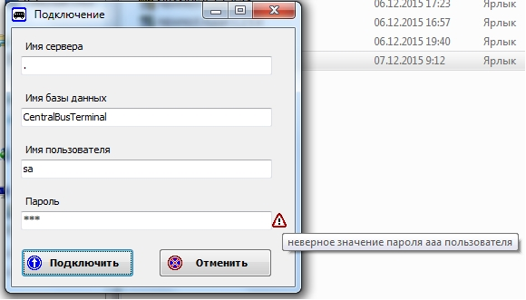
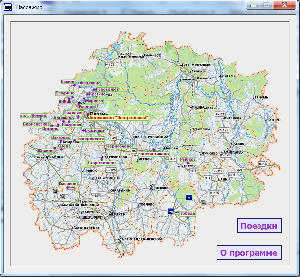
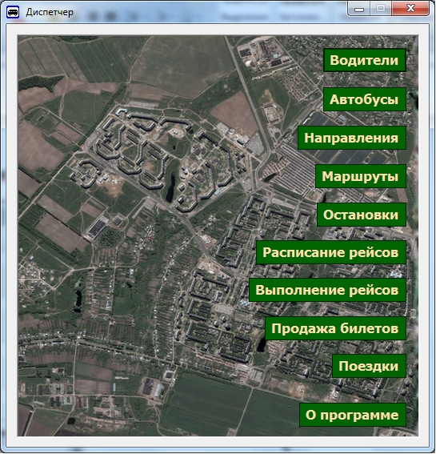
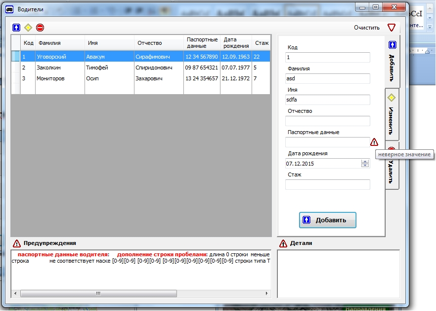
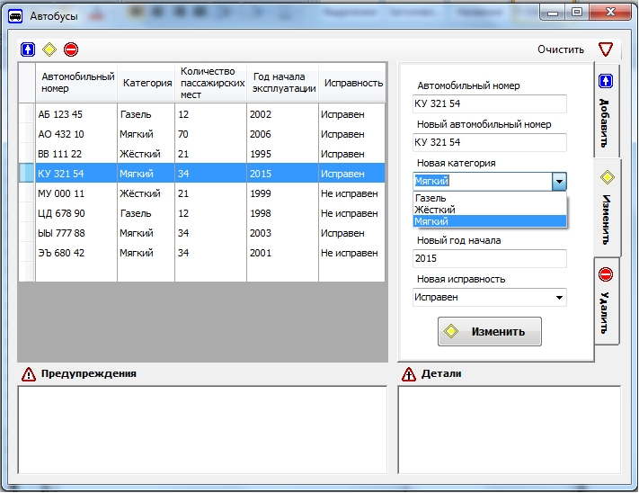
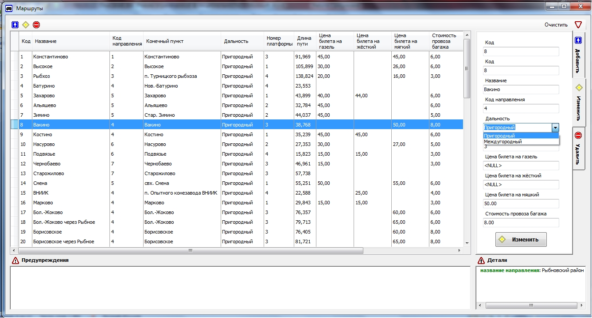
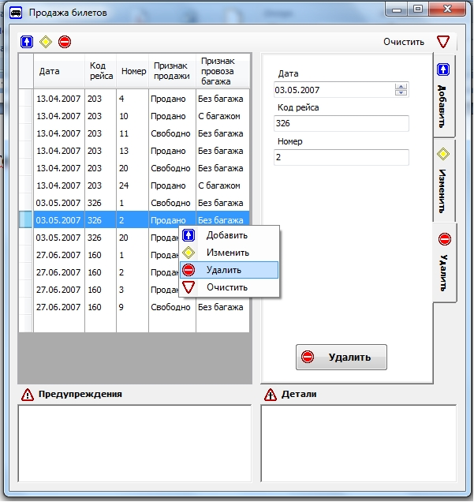
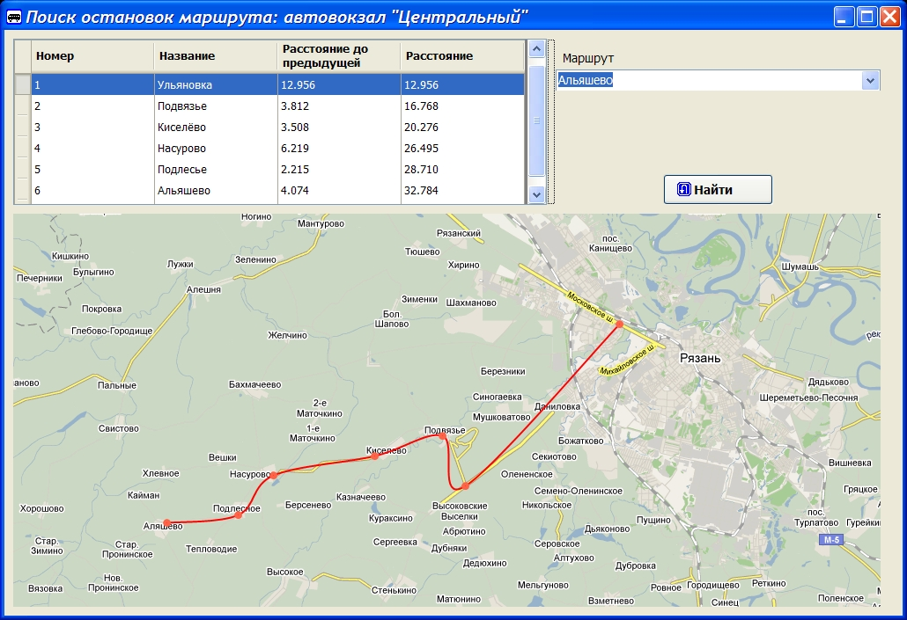
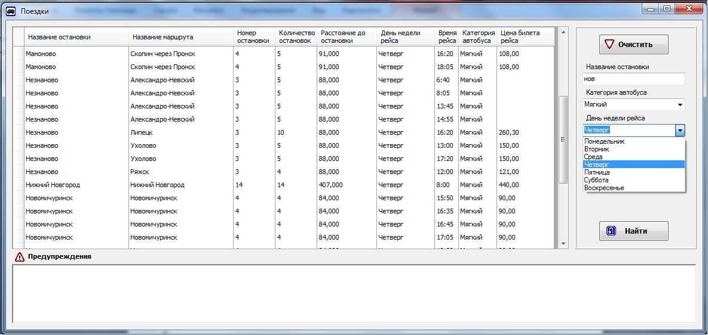
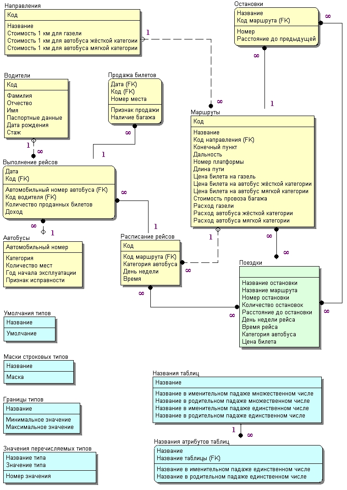
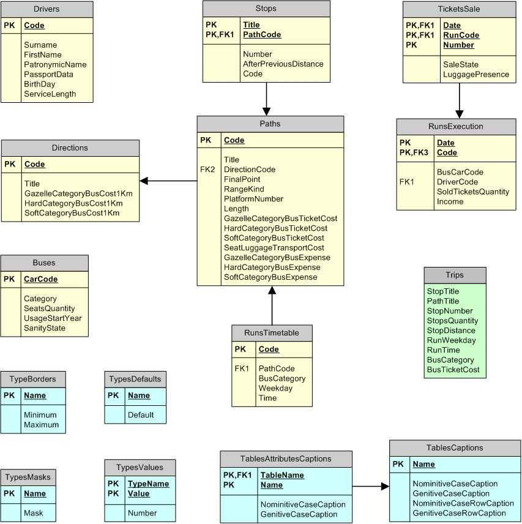
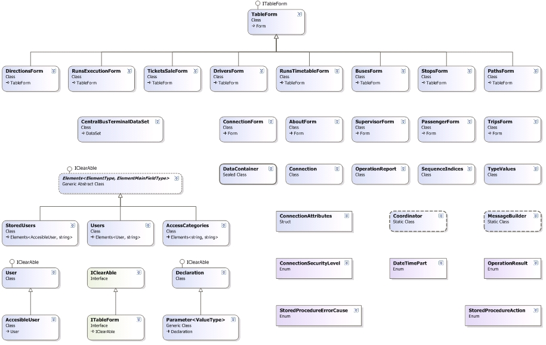

## Средства разработки
- **Языки программирования**: Transact-SQL, C#.
- **СУБД**: Microsoft SQL Server 2008.
- **Платформа**: Microsoft Framework 2.0.

## Описание программы
База данных и клиентское приложение, выполняющие операции, которые характеризуют деятельность рязанского автовокзала "Центральный".
Домены типов SQL, контроль ввода данных, аутентификация пользователя.

Имя пользователя в режиме пассажира: **pa**
Пароль в режиме пассажира: **pa**

Имя пользователя в режиме диспетчера: **sa**
Пароль в режиме диспетчера: **sa**

## Статус проекта
Проект завершён.

## Контакты
Котова Екатерина Александровна,
e-mail: katekotova_86@mail.ru